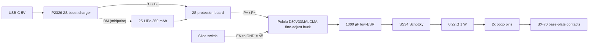

# SX-70 External Power Pack — Design v0.4

Rechargeable external supply for the folding SX-70, replacing the PolaPulse battery when shooting battery-less film (i-Type) or dead packs.

Two architectures are carried in parallel until the bench measurements in [testing.md](testing.md) settle the choice. **Option A** (4× regulated 1.5 V AAA, no converter) is simpler and wins if the motor's peak draw stays under ~1.8 A. **Option B** (2S LiPo + USB-C charger + adjustable buck) is the fallback and is detailed first below.

Camera batteries were ruled out early: no bare NP-FW50 socket is sold anywhere — only dummy batteries, which are the wrong gender — and the NP-F holders that do exist are ~89 × 96 mm.

**Envelope:** Option B **86 × 50 × 17.7 mm** — 9 mm inside the 95 mm camera-bottom limit, after the TPS63070 replaced the Pololu module. Option A ~77 × 52 × 18.7 mm. Height is now set by the PCB stack (floor + 2.6 mm standoff + board + C1), not by internal bosses. Layout drawings: [layout-top-lipo.svg](../hardware/enclosure/layout-top-lipo.svg), [layout-top-aaa4.svg](../hardware/enclosure/layout-top-aaa4.svg).

---

## Camera constraints — measured

| | | |
|---|---|---|
| Max width of the camera bottom | **95 mm** | Hard ceiling on the pack's long axis |
| Base-plate contact spacing | **~50 mm** | **Provisional** — to be confirmed on the next camera opened |

The other pack axis runs along the camera's ~170 mm length and can grow freely. The 50 mm spacing exceeded the old 46 mm electronics bay, which is what drove the pack to an L-shaped carrier board — see [pcb.md](pcb.md).

---

## Design goals

- Supply ~6 V to the camera's **base-plate contacts**, with source impedance similar to a PolaPulse (~0.5 Ω), so a jam can't dump unlimited current through the motor. (See *Power* in the servicing notes.)
- Charge in place over USB-C, with cell balancing.
- Near-zero drain when switched off.
- No backfeed conflict when a battery-equipped SX-70/600 pack is loaded.
- **Camera stays electrically unmodified.** Pogo pins press onto existing contacts; the only irreversible step is a 3 mm hole in the skin. Nothing is soldered to the camera.

---

## Block diagram



---

## Option B — bill of materials

| Ref | Part | Notes |
|---|---|---|
| B1 | [Gens Ace 350 mAh 2S 30C LiPo (GEA3502S30JST)](https://store.hobbyetc.com/parts/view/186378) | 35 × 26 × 10 mm, 17 g. Use the balance lead for the midpoint. |
| U1 | 2S protection board (DW01/8205-class or similar) | Overdischarge ~2.8–3.0 V/cell, overcurrent ≥ 5 A. Rides on top of the pouch with Kapton between. |
| U2 | IP2326 2S USB-C boost charger module ([example listing](https://sigmanortec.ro/en/lithium-2s-3s-charging-module-with-balancing-type-c-voltage-booster), [IP2326 datasheet](https://wmsc.lcsc.com/wmsc/upload/file/pdf/v2/lcsc/2304062030_INJOINIC-IP2326_C2832094.pdf)) | ~31 × 15 mm. **Reduce charge current**, see below. |
| U3 | [Pololu D30V33MALCMA, 1.4–7 V 3.8 A fine-adjust w/ low-voltage cutoff](https://www.pololu.com/product/4852) | 11-turn output pot and 11-turn LVC pot; set LVC ~6.4 V (3.2 V/cell). 0.9″ × 1.2″. Check stock — the family was backorder-only. |
| C1 | 1000 µF 10 V low-ESR (polymer preferred) | On regulator output, *before* D1/R1. |
| D1 | SS34 (3 A 40 V Schottky) | Blocks backfeed from a film-pack battery. |
| R1 | 0.22 Ω 1 W | PolaPulse impedance emulation; tune after shunt measurements. |
| SW1 | SS12D00 SPDT slide switch | Pulls EN low for off. |
| P1 | [Mill-Max 7982-1-15-20-75-14-11-0](https://www.digikey.com/en/product-highlight/m/millmax/high-current-small-scale-spring-loaded-pins) spring-loaded pin, through-hole (×2) | 8 A (6.4 A derated), 20 mΩ max, 0.7 mm stroke, 60 g mid-stroke, 2.1 mm body, gold throughout. ~$1.55 ea at Digi-Key. Soldertail into the carrier PCB |
| PCB1 | Carrier PCB, 2-layer | Carries P1, C1, D1, R1, SW1, J2, J3 and the two modules. See [Carrier PCB](#carrier-pcb) |
| — | M2.5 brass heat-set inserts, 3.5 mm OD × 4 mm (×4) | Lid fixing. Measure yours — OD and length vary by supplier; `insert_d`/`insert_l` in the SCAD. |
| — | M2.5 × 8 mm countersunk machine screws (×4) | Lid. Length covers lid + lip + insert. |
| — | Neodymium discs, 6 × 2 mm (×4) | Bonded into the base. N52 if the holding test is marginal. |
| — | Steel shim, 0.3–0.5 mm + 3M VHB | Camera side. Ferrous — not stainless, much of which is not. |
| — | Slow-cure epoxy | Bonding magnets. Not CA: it is brittle in shear and lets go when the pack is twisted off. |

---

## Electrical notes

### Charge current — and the 1C target may not be reachable

The module ships at ~1.4–1.5 A, about **4C** on a 350 mAh pack. That must come down. Current is set by the **ISET** resistor:

| ISET | Charge current |
|---|---|
| 60 kΩ | 1.5 A |
| 75 kΩ | 1.2 A |
| 100 kΩ | 0.9–1.0 A |
| 120 kΩ | 0.75 A |
| **180 kΩ** | **0.5 A** |

**0.5 A appears to be the floor.** The documented range is 120–60 kΩ, with 180 kΩ/0.5 A the lowest figure found anywhere. Our 350 mA target would need ~257 kΩ, outside anything documented — so **1C on a 350 mAh pack is probably not achievable with this chip.**

Two ways out:

1. **Accept 0.5 A ≈ 1.4C.** A 30C-discharge pouch will survive it; cycle life suffers somewhat. Simplest.
2. **Go to a ~500 mAh pack**, which makes 0.5 A exactly 1C. Capacity was never the constraint, so the only cost is footprint — and the battery zone is currently sized 35 × 26 mm for the 350 mAh cell, so **check a 500 mAh pouch still fits before committing.**

Either way: fit the resistor, then **verify with an inline USB-C meter** before trusting it.

### The specific module — Z-6732-V4.0 (purple, 2S)

Confirmed from the vendor photo:

| | |
|---|---|
| Chip | **IP2326** — marking verified, not a house code |
| Config | 2S variant |
| Front pads | `GND`, `VIN+` (so it can be fed without USB-C), `B+`, `B−` |
| Back pads | `LED`, `NTC`, `GND`, and **`BM`** between `B−` and `B+` |
| Silkscreened config points | `ISET`, `NTC`, `ROV` |
| Mechanical | 4 plated corner mounting holes; 2.2 µH inductor; 100 µF 16 V electrolytic |

Three things follow:

- **`BM` is broken out**, so balancing is actually available. This was the one feature the whole drift analysis depends on, and plenty of 2S modules omit it.
- **It is a charger, not a BMS**, whatever the listing says. There are only `B+`/`B−` pads — no `P+`/`P−`, no second protection IC, no pair of MOSFETs. **U1 is still required**, and the charger's B+/B− still route through U1's P+/P−.
- **`ROV` is the 3S select, not a spare pad.** Bridging it and removing the adjacent resistor converts the board to 3S, which is exactly the mode with no balancing. Leave it alone.
- **Order by the 2S/3S dropdown, not by colour.** The vendor sells 2S and 3S in both purple and black, and their photos pair black with the 3S board (`LX-LSC-V2`). **The 3S board carries a `BM` pad too**, in the same place — but the chip does no balancing in 3S, so that pad is decoration. Confirm the order says 2S.

`NTC` being broken out means the pouch thermistor is available if wanted — leave it unused otherwise.

**Identify the ISET resistor by the silkscreen, then measure it**, rather than trusting a value read off a photo. Three-digit codes decode as XY × 10^Z, so `184` is 180 kΩ and `104` is 100 kΩ. Several resistors on this board share those codes and only one is ISET.

**Height note:** the 100 µF electrolytic is the tallest thing on the module, and it stacks on top of the carrier PCB's own standoff. The height budget only has 0.3 mm of slack, so **measure the module's overall height before finalising the enclosure.**

### Balancing

**Balancing exists only in 2S mode.** The chip has no 3S balancing at all, and listings claiming otherwise are a reliable sign the vendor does not understand the part. 2S is our configuration, so this works in our favour — but it means the module must be left in its default 2S state: **CON_SEL floating**, the 2S/3S pad *not* bridged.

Balance current is 20–40 mA, set by Rcb (Icb = Vcb / Rcb, Rcb > 100 Ω) — which is the "tens of mA" figure the drift analysis below assumes.

Wire the IP2326 **BM** pad to the cell midpoint (centre wire of the balance lead). B+/B− go to the protection board's **P+/P−**, not directly to the cells, so the BMS guards charging too.

**The protection board does not balance.** A DW01/8205-class board only cuts off on per-cell over/under-voltage. If the cells drift apart it will trip on the high cell and end the charge early, leaving the pack progressively less full — it never corrects the imbalance. Balancing is the IP2326's job alone, which is why BM has to be connected.

**What BM balancing actually does.** It is passive top-of-charge balancing: during the CV taper the IP2326 bleeds the higher cell through an internal shunt at tens of mA. Two consequences:

- It corrects *slow drift* between reasonably matched cells. It will not rescue a badly mismatched pair — with tens of mA against a 350 mAh pack, closing a large gap takes many hours spread over many charges.
- **It only happens at the end of the charge.** Unplugging at "nearly full" skips the balancing phase entirely. If you habitually pull USB-C early, the cells will drift and nothing will ever pull them back. Leave it connected through the taper, and give it an occasional deliberate full charge.

**Starting matched.** B1 is a commercial 2S pack, so its cells arrive matched from the factory and this mostly takes care of itself. If you ever rebuild from loose cells, charge each to 4.20 V individually before assembling in series, and match them on capacity and internal resistance first — mismatched cells diverge faster than passive balancing can correct.

**Drift checks.** Meter the midpoint against B− at full charge:

| Cell delta | Action |
|---|---|
| ≤ 20 mV | Normal. This is the bring-up acceptance figure in [testing.md](testing.md). |
| 20–50 mV | Watch it. Do a full charge and re-check before the next shoot. |
| > 50 mV | Top-balance externally, then find out why. |
| Won't hold after balancing | One cell is failing. Retire the pack. |

**Keep the balance lead accessible.** The Gens Ace pack's JST-XH lead is the recovery path: a hobby charger (iMAX B6 or similar) can top-balance a drifted pack far faster than BM will, and can set a 3.8 V/cell storage charge if the camera is going away for a season. Leave the connector reachable inside the shell, or bring it out — if you bring it out, recess or cap it, because a shorted balance lead shorts a cell directly with no protection board in the path.

### Output regulation and source impedance

With a fixed 6.0 V regulator, D1 + R1 would put the camera at ~5.7 V idle and ~5.2 V at 2 A. A PolaPulse sagging through its ~0.5 Ω lands in the same place at 2 A, but it starts from ~6.0–6.3 V rather than 5.7 V, so a fixed module has less headroom than the real thing.

The fine-adjust regulator removes the question: dial the output so the **camera** sees ~6.0 V under load (roughly 6.6 V at the regulator, covering D1 and R1). Set the target from the measured floor voltage in [testing.md](testing.md).

Recovering headroom, in order of cost:

1. Raise the regulator setpoint (free with a fine-adjust part).
2. Drop R1 to 0.1 Ω — the regulator's own current limit already backstops a stall.
3. Replace D1 with a P-channel MOSFET disconnect (tens of mΩ instead of ~0.4 V).

### Shooting while charging

It will work, but **switch the pack off and let it charge.** Short answer: charge, then shoot.

There is **no power path**. The IP2326 module has only `B+`/`B−` — no separate system output — so the charger and the regulator both hang off the same node, U1's `P+`/`P−`. The load sits in parallel with the battery during charge rather than being fed separately.

Three consequences, in order of how much they matter:

- **Charge termination gets confused.** The IP2326 terminates on current taper. Load current at the same node looks like charge current, so the charger may taper late or never reach termination. Not dangerous — CV still clamps at 8.4 V and U1 still guards — but the pack's "full" indication stops meaning anything.
- **Balancing may never run.** Passive balancing only happens during the CV taper (see [Balancing](#balancing)). If load current prevents a clean taper, the one mechanism correcting cell drift never engages. This is the real reason to avoid it: the harm is slow and invisible.
- **The charger cannot supply a shot.** At 0.5 A into 8.4 V it delivers ~4 W; an exposure pulls ~12 W. The pack supplies the surge regardless, so charging buys nothing during the shot itself.

SW1 disables the regulator, not the charger, so charging with the pack switched off is the normal case and needs no extra hardware.

At 0.5 A a 350–500 mAh pack is full in roughly an hour, and a charge lasts hundreds of exposures — so there is no real scenario where shooting tethered is needed. A USB-C cable hanging off a folded SX-70 is its own argument.

**If tethered operation ever became a requirement**, the fix is a proper power-path front end, not a workaround — an ideal-diode load-share between charger, pack and regulator. That is a different charger IC, not a tweak to this one.

### Interlock — disable the output whenever USB is connected

Better than relying on discipline: make the two states mutually exclusive in hardware.

**Do not try to switch the charger off.** Two reasons it does not work:

- The module exposes no enable pad — only `GND`, `VIN+`, `B+`, `B−`, `LED`, `NTC`, `BM`.
- Switching VBUS instead would put **~0.93 A** through SW1 (4.2 W of charge at 5 V input, 90% efficient). An SS12D00-class slide switch is rated about 0.3 A. It would not last.

**Switch the regulator instead.** Pull the TPS630702's `EN` low whenever VBUS is present:

```
EN is high only when:  SW1 is on  AND  no USB connected

module VIN+ ──[100k]──┬── gate, 2N7002
                      └──[100k]── GND
                         drain ── EN node
                         source ── GND
```

Three things make this cheap: the module already breaks out `VIN+`, so VBUS needs no extra wiring; `EN` draws 0.2 µA max, so nothing has to drive current; and the part count is one small MOSFET and two resistors, well under $0.10.

It is also failure-safe in the right direction — unplug USB and the camera works again, with no state to get stuck in.

### Bonus: the same pin gives back the soft LVC

The TPS6307x has a **precise** EN threshold (0.77–0.83 V rising, 0.67–0.73 V falling) specifically so it can serve as a user-defined undervoltage lockout. That is the adjustable low-voltage cutoff we gave up when dropping the $35 Pololu — available here for two resistors.

A divider from the pack to `EN`, sized to cross the threshold at the chosen cutoff:

```
R_top = 698 kΩ, R_bot = 100 kΩ
Vpack 6.4 V → EN 0.802 V   (at the rising threshold)
divider draw at 7.4 V ≈ 9.3 µA
```

This cuts off gently at ~6.4 V, above U1's 2.8–3.0 V/cell hard cutoff, so the BMS stays a backstop rather than the normal stopping point — better for cell life.

**Put SW1 in series with the divider's top leg**, not across `EN`, so switching off removes the 9.3 µA as well. Otherwise it runs continuously and eats into the 2 µA shutdown figure that makes the standby budget work.

The MOSFET interlock and the LVC divider both act on `EN` and compose without conflict: the divider sets the floor, the MOSFET overrides to off.

### Switch-off drain

With the regulator disabled the standby draw is well under 100 µA including the protection board — months of shelf life. Top up every couple of months and before a shoot.

### Capacity

350 mAh at 7.4 V is ~2.6 Wh, ~2.2 Wh usable. A cycle costs roughly 1.5–2 A at ~6 V for about a second, ~0.003–0.005 Wh with electronics included: **400–600 exposures per charge**, or 50–70 film packs. Capacity is not the constraint; peak current is.

### No bleed resistor

The bench dummy pack uses ~1 kΩ bleed. It's omitted here deliberately: with a battery-equipped film pack loaded, a bleed after D1 would drain the film's battery at ~6 mA continuously.

### Film with its own battery — partial protection, and a real gap

**What is protected**

- **D1 blocks film → pack.** A Schottky in the output path stops a film battery backfeeding C1 and the regulator.
- **Switched off, the pack is fully isolated.** The TPS630702 disconnects the load in shutdown, so with SW1 off there is no path at all, in either direction. The output discharge also drains C1, and D1 stops that touching the film battery.

**What is not protected**

**D1 is a one-way device, and nothing stops the pack driving current *into* a film-pack battery.** That direction is forward-biased through D1. With the pack switched on and a battery-bearing film pack loaded:

| Film battery | Result |
|---|---|
| Fresh, 6.2 V | Higher than our ~5.6 V at the pins — **D1 blocks, nothing flows** |
| Part-used, 5.0 V | **~0.67 A** pushed into the cell |
| Dead, 3.0 V | **2 A**, the regulator's limit, sustained |

The loop is R1 (~0.35 Ω) + pogo pins (0.04 Ω) + the PolaPulse's own ~0.5 Ω, so roughly 1 Ω — nothing meaningful limits it.

**A PolaPulse is a zinc-chloride primary cell. It is not rechargeable and can vent or leak.** Inside the film compartment.

**The bad case is the main use case.** This pack exists partly to revive cameras whose film-pack battery is flat — and a flat film battery is exactly the condition that produces the highest fault current. A fresh pack is safe; a dead one is not. That is the wrong way round.

**Current mitigations, all procedural**

1. **Use i-Type film**, which has no battery. The design intent, and it makes the whole question moot.
2. **Switch the pack off** before loading battery-bearing SX-70/600 film. Genuinely safe, because of the load disconnect — not merely "best practice".
3. Never leave the pack switched on with a battery-bearing pack loaded.

**Hardware options, in order of cost**

### 1. Procedural only — status quo

Zero parts. Relies on switching off before loading battery-bearing film. Safe when followed, because the load disconnect is real.

### 2. PTC backstop — one part

A resettable fuse in the output path. It does not *prevent* the fault, it ends it.

- The motor pulse is ~2 A for ~1.5 s then idle, so the device cools between shots. The fault is ~2 A **sustained**. A PTC with roughly 1 A hold / 2 A trip takes seconds at 2 A — it trips on the fault and survives a single cycle.
- **Its hold resistance (0.1–0.3 Ω) sits in the same loop as R1**, so it substitutes for part of R1 rather than adding to it.
- **Risk: nuisance tripping.** Eight shots back to back is the case to test, and PTC resistance drifts with temperature, so source impedance stops being a fixed number.

Cheap and honest, but it protects the cell rather than preventing the current.

### 3. Sense-and-latch — prevents it

Sample the output node at switch-on, while the regulator is still disabled. With the output disconnected, a film-pack battery shows up there; an i-Type pack shows 0 V because the camera is dormant. **The threshold can be low — around 1 V — because it only has to answer "is anything driving this node?"** It does not need to distinguish a fresh cell from a flat one.

A latch is unavoidable. Once our own output comes up, the sense sees our voltage and would inhibit itself, so the decision has to be taken once and held.

**Discrete version** — about 11 parts, ~$1:

| | |
|---|---|
| LM393 dual comparator | 36 V rated, so it runs straight off the pack with no logic rail |
| ½ LM393 | Divided sense node against the reference |
| ½ LM393 | Positive feedback, wired as the latch |
| TLV431 | Shunt reference — a plain divider would drift with pack voltage |
| RC | Holds EN low during the sample window |
| MOSFET | Pulls EN low; can share the node with Q1 |
| LED + R | Indicator |

**MCU version** — about 9 parts, ~$0.80 plus firmware: an ATtiny202 and a small LDO. Reads the node at power-up, drives EN, shares an LED for status. More flexible — it could also show charge state or blink codes — at the cost of putting firmware in an otherwise analog design.

Either needs roughly **15 × 10 mm**, against about 20 × 8 mm currently free in the main body. Tight, and it may grow the board.

**Two things to weigh before building it**

- **Adding protection adds a failure mode.** A false inhibit means the camera silently does not fire, which in the field is worse than the problem being solved. An indicator LED is not optional here.
- **Make it fail toward inhibit**, so a dead sense circuit refuses to run rather than quietly removing the protection.

**Decision: option 2, the PTC.** The pack is built for i-Type film where this fault cannot occur, and switching off is genuinely safe rather than merely advised. Option 3 would earn its complexity only if the pack were used by someone else, or if battery-bearing film became routine.

### Choosing the PTC — the obvious part is the wrong one

**F1 = Littelfuse `1812L075`**, 1812 SMD, in the output path beside R1.

| Part | I_hold | I_trip | Against a 2.0 A fault |
|---|---|---|---|
| 1812L110 | 1.1 A | 2.2 A | **Below I_trip — may never trip.** Useless here |
| **1812L075** | **0.75 A** | **1.5 A** | 1.33 × I_trip — trips |

The 1.1 A part is the common one and the first thing you would reach for, but our fault is regulator-limited to 2.0 A, which sits in its indeterminate band between hold and trip. It could sit there indefinitely doing nothing.

**The window is narrow and cannot be closed on paper.** The fault and the motor pulse are the *same* 2.0 A, separated only by duration. The 1812L075 must trip on a sustained 2.0 A while surviving a ~1.5 s pulse at the same current — that is 1.33 × I_trip, where trip time is a few seconds. Close enough that it needs measuring.

**Buy both values and decide after [testing.md](testing.md) step 2.** If the real motor peak is higher than 2 A, both parts shift and this choice is reopened.

Two further notes:

- **Voltage rating.** The plain `1812L110PR` is rated 8 V, against 6 V across the device. Adequate but slim; the `/16` variants give more headroom for no real cost. Check the rating on whichever value is chosen.
- **It substitutes into R1's budget.** Hold resistance is 40–210 mΩ, in the same loop as R1 and the pogo pins. **Measure the fitted device and reduce R1 to match**, exactly as for the pins — otherwise the source impedance lands high.

---

## Camera connection

**Pogo pins onto the camera's base-plate contacts. No soldering to the camera at all.**

> **Assumption to confirm:** "the terminals on the camera" is read here as the **two power test contacts on the underside of the base plate**, behind the existing holes in the plastic base and hidden by the skin. That matches a bottom-mounted magnetic pack. If the intent is the *film-chamber* battery contacts instead, pogo pins cannot reach them from outside the film door and this section needs rethinking.

- Two **spring-loaded (pogo) pins** on the pack's camera-facing face, pressing into the base-plate contacts through the skin.
- **Skin modification:** mark through the existing base-plate holes, puncture, and round the opening to roughly **3 mm diameter**. The base plate itself is not modified. This is the only irreversible step.
- Establish polarity from a real film pack's battery with a meter before connecting anything.

### Why this is the better route

The previous plan soldered a pigtail to the traces feeding the film-chamber contacts. That meant putting a 350 °C iron on 50-year-old flex whose adhesive releases almost immediately under heat — bench 1-B lifted pads and traces on the first switch at 415 °C. **Pogo pins remove that risk entirely**, and with it the main reason this project might have destroyed a working body flex. Replacement routes remain documented in [flex-order.md](flex-order.md), but they are now insurance rather than an expected cost.

### What pogo pins add to the design

Specified part: **Mill-Max 7983-1-15-20-75-14-11-0**, from their high-current small-scale family. Real numbers, which settle three things I had estimated:

| | Spec | Note |
|---|---|---|
| Current | **8 A**, 6.4 A derated at 30 °C rise | Against a ~2 A peak. Enormous margin, and it removes current as a concern entirely |
| Contact resistance | **20 mΩ max** each | Pair in series = **40 mΩ**, not the ~0.1 Ω I first assumed |
| Spring force | **60 g** at mid-stroke | Pair = **120 g**, at the low end of my 100–300 g estimate — good news for the magnets |
| Stroke | **0.7 mm** | **Less than the ≥1 mm I specified.** See below |
| Body | 2.1 mm dia, 9.5 mm long, gold throughout | `pogo_body_d` corrected from 1.7 to 2.1 mm |
| Cycle life | 1,000,000 at half stroke | Irrelevant here, but it means nothing to worry about |

- **Current rating is no longer the gating spec.** Worth knowing why this family and not the obvious ones: Harwin's pogo pins top out at 1–2 A, and Mill-Max's standard 0906 series is spring-dependent and around 2 A. Against a 2 A peak, both are marginal. This family is not.
- **Contact resistance still counts against R1**, but at 40 mΩ it is a small correction to R1's 0.22–0.47 Ω rather than a fifth of it. Measure in circuit and subtract anyway.
- **0.7 mm stroke makes pin protrusion a measured dimension, not a tolerance sink.** This is the real design consequence. You cannot treat the pins as absorbing everything. But the seating is repeatable — magnets pull two hard, flat, bonded faces together — so the gap is fixed once built. What must be measured is the sum of skin thickness at the hole, contact recess depth behind the base plate, and magnet recess. Then set protrusion by **tuning `pogo_pad_h`**, which changes bore depth and therefore how far the plunger stands out. The SCAD echoes the resulting protrusion and warns if it falls below the stroke.
- **Gold on both plunger and sleeve**, mating a vintage nickel contact — keeps resistance low and stable.
- D1 still matters: the base-plate contacts are on the same rail as the film-pack battery, so backfeed protection is unchanged.

---

## Regulator — the Pololu is not the only option

The D30V33MALCMA is ~$35, and two of the things it is being bought for are questionable.

**Its adjustable low-voltage cutoff is largely redundant.** U1, the 2S protection board, already cuts at 2.8–3.0 V/cell. The regulator's LVC would only ever trip *earlier* and more gently. That is nice for cell life, not a safety function — and it is a meaningful part of what the $35 buys.

**It is a step-down.** As the pack falls toward 6.4 V the output sags, which the design currently tolerates because the camera runs down to ~5.2 V. A buck-boost would simply hold 6 V across the entire 2S range.

### Alternative: TPS63070 on the carrier PCB

| | |
|---|---|
| Topology | **Buck-boost** — regulates through the whole 8.4 → 6.0 V pack range |
| Input | 2–16 V |
| Output | 2.5–9 V, **2 A**, 3.6 A switch current |
| Price | **~$0.90 at LCSC** (C109322, in stock) |
| Package | QFN — assembled by PCBWay alongside everything else |

Roughly **$0.90 against $35**, and technically better for this job: no sag at low state of charge.

Three consequences:

- **Footprint.** A QFN plus inductor and caps is perhaps 15 × 12 mm against the Pololu's 30.5 × 22.9 mm. The Pololu is the second-largest thing on the board and part of why the pack is 58 mm wide. **This could shrink the pack noticeably** — worth re-running the layout before committing.
- **2 A output is exactly our assumed peak.** Fine if the real stall current is at or below that, but [testing.md](testing.md) step 2 has not been run. If the motor pulls more, this part is undersized and something like the TPS55288 is the next step up. C1 absorbs inrush, which helps.
- **Soft LVC, if wanted**, is a voltage supervisor pulling the EN pin low — a few cents, not $35.

### Setting 6 V on the TPS63070

**Order `TPS630702` (preferred) or `TPS63070`.** Both are adjustable. Avoid `TPS630701`, which is fixed at 5 V.

Output is set by a divider from VOUT to FB to GND, against an **0.8 V** reference:

```
Vout = 0.8 × (1 + R1/R2)  →  R1/R2 = 6.5 for 6.0 V
R1 = 649 kΩ, R2 = 100 kΩ  (E96 1%)  →  5.99 V
```

6.0 V sits comfortably inside the 2.5–9 V range. TI wants at least 2 µA through the divider, i.e. **R2 ≤ 400 kΩ**; 649 k/100 k draws 8 µA.

**Use the high-impedance divider, not 64.9 k/10 k.** The low-impedance version draws 80 µA continuously, which would dominate the standby budget on its own. 8 µA does not.

### Datasheet checks — resolved (SLVSC58B, Mar 2019)

**Load disconnect in shutdown: yes.** Listed in the features and stated outright: *"During shutdown, the load is disconnected from the battery."* SW1 on EN genuinely isolates the camera. **Shutdown current is 2 µA typ, 12 µA max** (−40 to 85 °C) — better than the Pololu module it replaces. The standby claim holds.

**2 A applies across our whole range.** The 2 A spec is conditioned on boost factor (VOUT/VIN) ≤ 1. With VIN 8.4 → 6.0 V and VOUT 6 V we are at or below 1 throughout, so 2 A is available until the BMS cuts.

**Start-up current limit is ~1 A** until power good asserts — that is the soft-start mechanism.

**⚠ Maximum output capacitance is 470 µF. C1 at 1000 µF violates it.** Recommended Operating Conditions give 15 µF min / 47 µF nom / **470 µF max** on VOUT for the nominal 1.5 µH inductor. C1 must come down — 2 × 220 µF polymer (440 µF) fits. For scale, TI's own reference design uses 66 µF; 440 µF is already generous by the chip's standards. Whether it is enough for the *motor* is what [testing.md](testing.md) step 2 answers.

**Variant table — and a correction.** All three differ less than I first said:

| Part | Output | Output discharge |
|---|---|---|
| TPS63070 | **adjustable** | off |
| TPS630701 | fixed 5 V | off |
| **TPS630702** | **adjustable** | **on** |

TPS630702 is *also* adjustable — the datasheet says output discharge "is the only difference between TPS63070 and TPS630702". Only the **TPS630701** is fixed and therefore unusable here.

**Prefer the TPS630702.** Its internal discharge resistor drains the output capacitor whenever the device is disabled. With pogo pins exposed on the outside of the pack, not leaving 440 µF charged to 6 V on them is worth having. It does not conflict with the *No bleed resistor* decision below, because the discharge sits on the converter's output — ahead of D1 — so it cannot drain a film pack's battery.

### Middle option

A TPS63060-based adjustable buck-boost module, ~$6, if a module is preferred over designing the IC in. Still buck-boost, still far cheaper, but it keeps the module-footprint problem.

---

## Carrier PCB

Everything in the output path — the pogo pins, D1, C1, R1 and SW1 — sits on one 2-layer carrier board, with the IP2326 and Pololu modules mounted to it. Only the cells and the 2S protection board stay off-board on wires.

This started as loose modules joined by flying leads with the pins press-fitted into printed bosses. That was wrong for four reasons:

- **Pin position needs to be accurate.** With only 0.7 mm of stroke, where the plungers sit matters. A PCB holds them to ±0.1 mm; a printed boss holds them to print tolerance, which is the wrong order of magnitude for the job.
- **2 A belongs in copper, not wire.** D1, C1 and R1 are all in the motor-current path. Hand-wired, every joint adds resistance in series with an R1 we are trying to set deliberately to ±0.05 Ω.
- **C1 has to be close to the load.** Its whole purpose is supplying motor inrush. Flying leads add inductance in exactly the place that defeats it.
- **Fewer joints.** This pack gets opened repeatedly during bring-up; hand-wired assemblies fail at the joints.

### What this changes

- **P1 becomes the through-hole pin, not the solder cup.** 7982-1 instead of 7983-1 — and it is cheaper, $1.55 against $1.90. The solder cup only made sense while there was no board to solder to.
- **The printed pogo bosses are deleted.** The pins are held by the PCB. The case floor keeps only the two clearance bores for the plungers.
- **PCB standoff sets pin protrusion**, and it is a controlled dimension:

| | |
|---|---|
| Pin height above board | 5.2 mm |
| Case floor | 1.6 mm |
| Target protrusion past outer face | 1.0 mm |
| **→ PCB underside sits** | **2.6 mm above the case inner floor** |

- **The PCB clears the magnet pads.** They are 1.5 mm tall, so a 2.6 mm standoff passes over them with 1.1 mm to spare. That removes the other collision the layout drawing found — the boards no longer have to dodge the magnets.
- Height budget: floor 1.6 + standoff 2.6 + PCB 1.6 + tallest part ~10 mm = 15.8 mm, inside the 17.1 mm base with 1.3 mm spare.

### Still open

- Module mounting: headers, or castellated pads? Headers cost height, which the budget above does not have much of.
- The two modules side by side still need 37.9 mm across a 36 mm bay, so they rotate 90° or stack. See the layout drawing.
- Mounting-hole positions and outline are undefined until the layout is drawn. `pcb_posts` in the SCAD is empty until then.
- PCBWay is the obvious fab — same account as the flex orders, and a 2-layer board this size is a rounding error against the $25.44 the flex PCB cost.

---

## Mechanical

- Enclosure: `sx70_power_pack.scad`, base + lid, print in **PETG**. Boards sit on the floor on foam tape; the divider is lower than the walls so leads pass over it.
- All bay and cutout dimensions are parametric placeholders. **Caliper the actual parts** (especially USB-C height `usb_z`, switch position, and the Pololu envelope) before printing.
- **Option A shell:** set `battery_option = "aaa4"`. The battery bay grows to fit a 4-cell AAA holder and the electronics bay shrinks to the cap, resistor and switch.

### Lid fixing — brass heat-set inserts

Four M2.5 heat-set inserts in the base bosses, countersunk machine screws through the lid. Self-tapping screws into PETG were the earlier plan; inserts survive repeated opening, which this pack will see a lot of during bring-up.

- Boss OD is derived as `insert_d + 3.0`, leaving ~1.5 mm of PETG around the bore. Thinner than that and the insert splits the boss out sideways as it melts in.
- The bore has an `insert_lead` chamfer at the mouth so the insert starts square, and `insert_relief` of extra depth below it so displaced plastic has somewhere to go rather than jacking the insert back out.
- Insert dimensions vary by supplier. **Measure yours** and set `insert_d` (OD minus ~0.1 mm melt interference) and `insert_l`.
- Install with a temperature-controlled iron at ~200 °C for PETG, straight down. Let the boss cool before applying any screw load.

### Pogo pins

Two spring-loaded pins press through the camera-facing face into the base-plate contacts. Electrical requirements are in [Camera connection](#camera-connection); the shell side:

- Bores run through the floor into a local **2.5 mm boss**, giving ~4.1 mm of grip for the press fit. 1.6 mm of floor alone is not enough to hold a pin square under spring load.
- An outer lead-in chamfer eases the pin in and gives the skin hole something to centre against.
- Defaults place both pins in the **electronics bay**, so their solder tails are not underneath the battery. If your camera's contact spacing forces one into the battery bay, re-check the pack still fits above the boss.
- **`pogo_spacing` and `pogo_body_d` are placeholders.** Measure the contact spacing on your own base plate and the barrel diameter of the pins you actually buy.
- These bosses are now the tallest thing inside the shell, so they, not the magnets, set the external height.

### Magnet mounting

The folding SX-70 has no tripod socket, so the pack is held by **magnets bonded into the base, mating to a thin steel shim on the camera.**

- Four 6 × 2 mm discs in pockets that open on the outer, camera-facing face, sized with `magnet_fit` clearance per side for adhesive. Bonded with slow-cure epoxy — not a press fit, and not CA.
- Magnets sit `magnet_recess` (0.3 mm) below the face so bare magnet never touches the camera, and are backed by `magnet_back` (0.8 mm) of PETG.
- **The pockets are deeper than the floor**, so the SCAD raises a local backing pad inside the shell and deepens the cavity by the same amount. `inner_h` therefore means clear height *above* the pads; the outer height grew ~1.5 mm as a result. If you change `magnet_t`, the shell height follows automatically.
- **Polarity is irrelevant** against a plain steel shim — any orientation attracts. That removes an entire class of assembly error, and is a good reason to prefer a shim over magnets on both halves.
- Keep the magnets away from the PM motor in the camera base and the shutter solenoid in the lens housing. **Re-shoot a test frame after mounting** to confirm exposure hasn't shifted.
- **The magnets must beat the pogo pins' spring force**, which is 100–300 g for two pins trying to push the pack off. Test holding force with the pins fitted and compressed, never on a bare shell.
- `mount_holes` still supports screwing through the floor instead, if a film-door-safe location is ever confirmed.

### Print and assembly order

- Print the base floor-down. The magnet pockets then open at the bed and their ceilings bridge ~6 mm, which PETG handles.
- **Inserts first, then magnets.** Both involve heat; melting inserts in next to cured epoxy risks softening the bond.
- Check the four backing pads clear your actual parts before printing — they intrude into the bays. The default placement keeps them out of the divider and the screw bosses, but they do sit under the battery.

---

## Option A — 4× regulated 1.5 V AAA

Four [XTAR 1.5 V AAA cells](https://www.xtar.cc/product/xtar-aaa-lithium-1620mwh-battery.html) (1620 mWh / 1000 mAh, 1200+ cycles, 1.9 h charge) in series give a flat 6.0 V with no converter and no charge circuit — the BOM drops to a holder, C1, R1, a switch and the JST lead. ~6.5 Wh, roughly 2.5× Option B.

**Gating spec:** the datasheet curve is labelled 2 A max per cell, which caps the whole series string at 2 A. If the motor's peak exceeds that, an internal converter may fold back or hiccup mid-cycle — an intermittent stall rather than an obvious fault.

Other trade-offs:

- Charging moves off-camera (XTAR charger).
- Regulated cells hold 1.5 V then drop off a cliff at cutoff — no sagging warning. Keep a matched spare set.
- Still a stiff, low-impedance source: **keep C1 and R1**.
- Charge and rotate the four cells as a matched set; a mismatched string collapses when the first cell cuts out.

---

## Bring-up checklist

See [testing.md](testing.md) for the full procedure and the two measurements that decide the architecture.

---

## Open items

Mirrors *Open questions* in the [README](../README.md). Ordered by what blocks what.

**Blocking — nothing downstream can be finalised without these**

- [ ] **Are the base-plate contacts a real power rail, or a high-impedance test tap?** [testing.md step 0](testing.md). If they collapse under load the whole pogo-pin interface has to move.
- [ ] Camera floor voltage and motor peak current — these choose Option A or B. [testing.md 1–2](testing.md)

**Blocking the enclosure**

- [ ] Contact spacing on the base plate, and the barrel diameter of the pogo pins actually bought → `pogo_spacing`, `pogo_body_d`.
- [ ] Measure actual part envelopes and update the SCAD bay parameters.
- [ ] Mounting location on the camera base that clears the film door and keeps magnets off the motor and shutter solenoid.
- [ ] Magnet holding force tested with the pogo pins fitted and compressed, not on a bare shell.

**Design decisions still open**

- [ ] Does Option A need D1 as well? Both options now sit on the same rail as the film-pack battery, so the backfeed case looks identical, but only Option B's BOM carries the Schottky.
- [ ] R1 final value, after the shunt measurement — and remember to subtract the pogo pins' own contact resistance.

---

## Changelog

**v0.4 — 23 Sept 2026**

- **Carrier PCB added.** The pogo pins, C1, D1, R1, SW1 and the battery connectors move onto one 2-layer board, with the modules mounted to it. Loose modules on flying leads were wrong for a 2 A path with a 0.7 mm-stroke pin whose position has to be accurate.
- **Camera constraints recorded**: bottom width **95 mm** (hard ceiling), contact spacing **~50 mm** (provisional). The 50 mm span exceeded the old electronics bay, forcing an **L-shaped board** — a full-length lane carrying both pins, plus a main body under the modules.
- **The battery moved off the board** onto the case floor beside it, which is what keeps the pack thin.
- **P1 reverted to the through-hole pin** (7982-1, $1.55) from the solder cup (7983-1, $1.90). The cup only made sense with no board to solder to.
- **J2 (pack power) and J3 (balance tap) added** — the battery had no defined connection at all. Both JST-XH, because PH's 2 A rating is exactly the current drawn.
- **J1 dropped.** It survived the pogo-pin change as a bench output for the dummy pack, but it was the one part with no required role, and it carried 2 A on a 2 A connector. The dummy pack can be fed from the bench supply as before.
- Envelope **92 × 58 × 17.7 mm**, inside the 95 mm limit and 1 mm thinner than v0.3. Layout verified collision-free by `scripts/layout_svg.py`.

**v0.3 — 23 Sept 2026**

- **Camera interface changed to pogo pins** on the base-plate contacts, replacing a JST-PH pigtail soldered to the traces feeding the film-chamber contacts. The solder route meant a 350 °C iron on 50-year-old flex whose adhesive releases under heat; bench 1-B lifted pads and traces at 415 °C. J1 is retained as a bench output only. Added: ≥3 A pin rating, gold plating, the pins' contact resistance counting against R1, and spring force working against the magnets.
- **Enclosure fixings changed to M2.5 brass heat-set inserts** from M2 self-tapping screws — this pack gets opened repeatedly during bring-up.
- **Magnet mounting detailed**: 4× 6 × 2 mm discs epoxied into pockets on the camera-facing face, against a VHB-bonded steel shim. Polarity is irrelevant against plain steel.
- **Shell height is now set by internal bosses.** Magnet pockets are deeper than the floor and pogo pins need grip length, so `inner_h` means clear height *above* the bosses and the cavity deepens automatically. Option B grew to ~88 × 40 × 19 mm.
- **Balancing section expanded** — the protection board does not balance, and passive balancing only runs during the CV taper.
- **testing.md step 0 added**: confirm the base-plate contacts are a real power rail, not a high-impedance test tap. Everything rests on it.
- Replacement flex routes and PCBWay order prep split into [flex-order.md](flex-order.md); lens-flex reverse-engineering workspace added under `hardware/flex-lens/`.

**v0.2** — two architectures carried in parallel (Option A 4× AAA, Option B 2S LiPo); fine-adjust regulator with low-voltage cutoff replaced the fixed 6 V module.

**v0.1** — initial 2S LiPo design, fixed 6 V Pololu D24V22F6, soldered pigtail.
